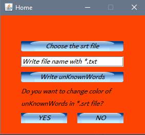
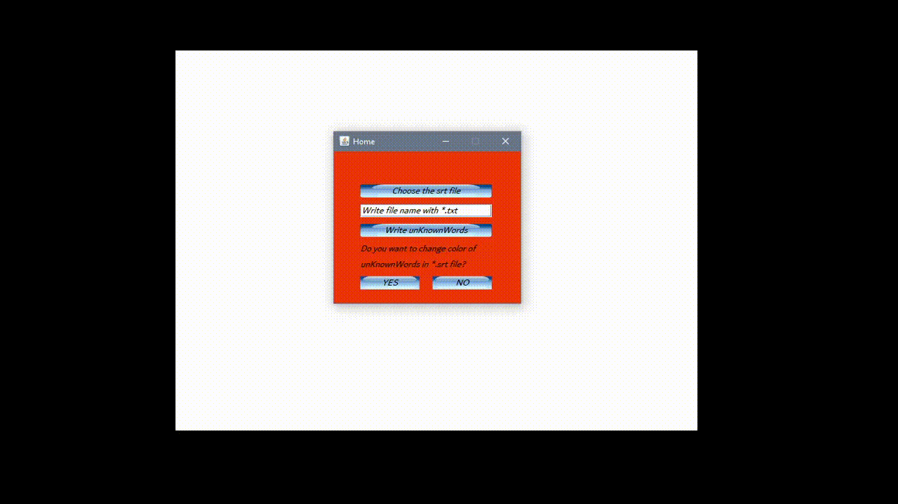

# Learn-English-With-*.srt-Files
> Learn words that you don't know with *.srt files

## Installation

You can download a executable JAR file\learn_english-1.0-SNAPSHOT.jar file.  But careful you must download with *.png files. Then you can run via just clicking or in Windows, you can run via cmd:

`java -jar learn_english-1.0-SNAPSHOT.jar`

## Usage Example

When you run the *.jar file, you will see home screen.

Then, first you must choose SRT file, second write name of the file with extension that contains unknown words and their meaning. If you want to change color of unknown words, you can click the YES button, then choose the color.

Have a nice try!

If you run into a problem, you can let me know here or on my Twitter account. - [@Mehmetkaragoz07](https://twitter.com/Mehmetkaragoz07) - karagoz.mhmtg@gmail.com

https://github.com/mehmet-karagoz